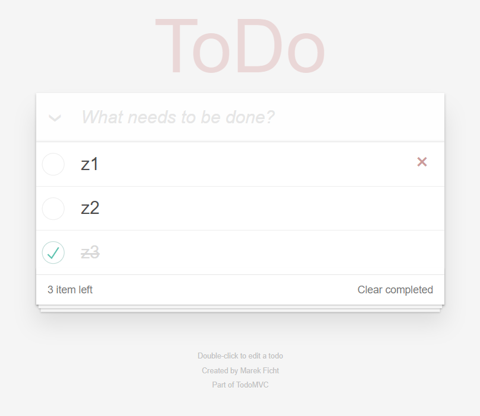

# Application with REST API - ToDo List

Full stack program with jQuery and Node.js on the backend.

The page after refreshing still displays the correct data thanks to db.json (it's our databases). 

## Installation and configuration

- Instal Node.js -> [NodeJS](https://nodejs.org/en/)

When you're in the folder in all files
- Open your command line/terminal, enter -> `node ./backend.js` or `node backend`

If you want to facilitate the work on changes, I recommend to install `npm i nodemon -g` -> [nodemon](https://www.npmjs.com/package/nodemon)

<!--  -->

	<!--  -->

**text** - pogrubienie
_text_ - pochylenie 
[CO-MA-SIE-WYSWIETLAC](https://firebase.google.com/)
DODANIE OBRAZKA:
	if your file is in repository

	if your file is in other external url

jaka kolejnosc najlepiej: 
krotki opis projektu / instalacja / konfiguracja / 
screen shot(jesli strona) / opisane technologie / dalszy pomysl na rozwoj tego

# Nazwa repo

This is final project at the end of the holidays CodersLab course.
This project is a simple chat where registered and logged in users can communicate
with each other. [FIREBASE](https://firebase.google.com/) was used in this project as a backend.

### Installation and configuration

Download files, open your command prompt, go to chat folder and type npm run.

### Screenshot(OPCJONALNIE)

## Built of ...

- [JavaScript](https://developer.mozilla.org/pl/docs/Web/JavaScript) - Javascript
- [React](https://reactjs.org/) - Javascript framework
- [CSS](https://developer.mozilla.org/pl/docs/Web/CSS) - Cascading Style Sheets
- [HTML](https://developer.mozilla.org/pl/docs/Web/HTML) - HyperText Markup Language
- [FIREBASE](https://firebase.google.com/) - Backed by Google

### Further idea for development

## Authors(OPCJONALNIE)

- **Marek Ficht** - _Initial work_ - [MarkFicht](https://github.com/MarkFicht)
